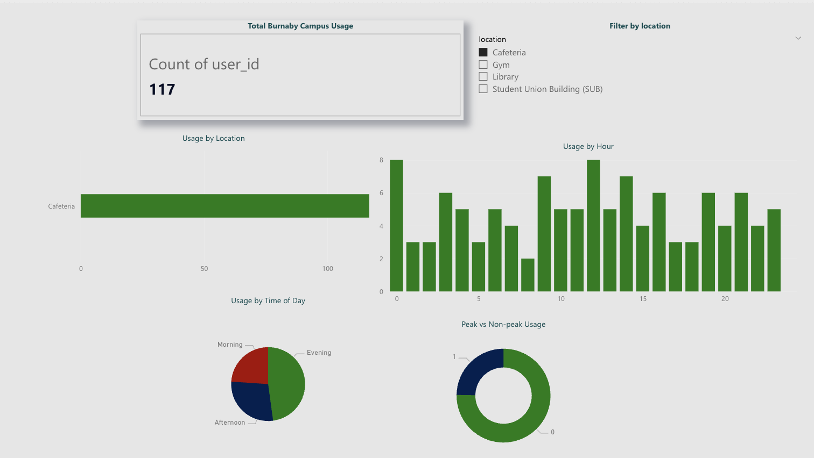

# campus-resource-utilization-analysis
## Idea

This project analyzes sfu's burnaby campus facility usage patterns to identify peak demand periods and underutilized resources in the library, SUB, gym and cafeteria.
The goal is to support data driven decision-making by students for efficiency.

(synthetically generated dataset), including time based behavior and location specific demand.

---

## Tech Stack

* **Python** (Pandas, NumPy)
* **SQL** 
* **Power BI** – interactive dashboard and visualization

---

## Key Features

* End-to-end data pipeline from raw data to dashboard
* Data cleaning and transformation using Python
* SQL-based analysis of usage trends and behavior
* Interactive Power BI dashboard with filtering and dynamic visuals

---

## Key Insights

* The **Library** and **Gym** experience the highest usage levels
* Peak demand occurs during **mid-day hours (11 AM – 3 PM)**
* The **Student Union Building** shows relatively lower utilization
* Usage patterns are consistent across time-of-day segments

---

## Dashboard Preview

---

## Interactive Dashboard

The Power BI dashboard provides an interactive view of campus resource usage.

👉 Download and explore the dashboard file:
`dashboard/campus_dashboard.pbix`

---

by Ebube Nwasike
